After the success of the first Ruby Unconf, we–the orga team–were nervous if we could repeat the experience. Turns out, we could top it! (New to the Unconference topic? We have got you covered [with a nice blog post](https://2019.rubyunconf.eu/2019/04/29/unconf.html).)

We met again in the rooms of HAW Finkenau, last year’s location. This media school has been very welcoming and supportive to us, and we’d like to thank them for it.

The first day of the Unconf coincided with Towel Day, so of course we *had to* put towels in our goodie bags. They were quite the hit!

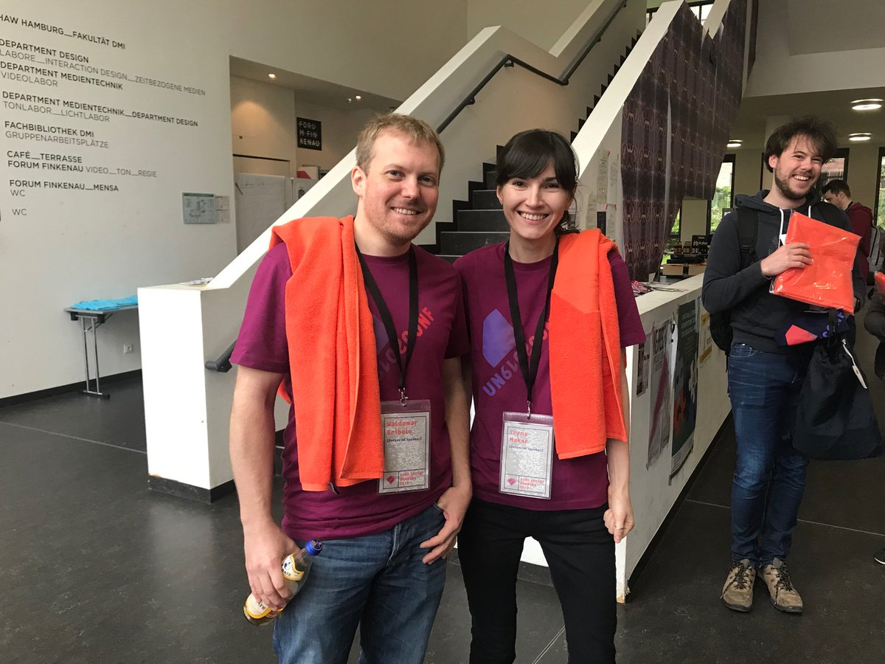

Nothing is more flattering than to see people come to us a second time, and we saw many familiar faces. We were also thrilled to see many new visitors from outside of Germany. We hadn’t expected our little Unconf to attract such an illustrious and international crowd :)

Terence Lee delivered a fantastic keynote about all the ways Ruby has influenced the world of programming. Everyone knows how Rails changed the web framework landscape, but did you know that webdev bootcamps started in the Ruby community? [Watch the talk here!](https://www.youtube.com/watch?v=I9aip9qoXew)

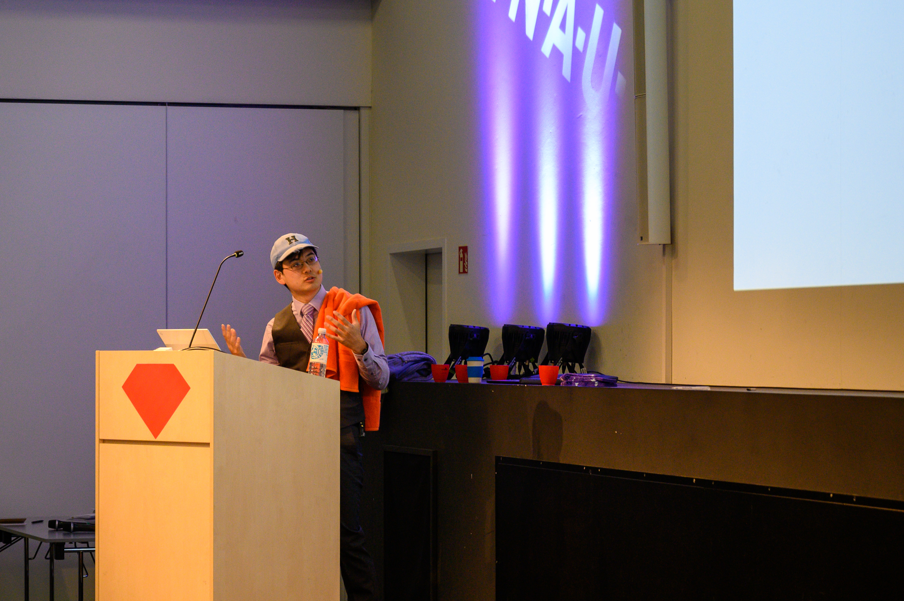

Every candidate pitched their talk, and then everyone could vote with stickers. We had some great talks with a huge variety, from very technical Ruby topics to Kubernetes or Functional Programming. [Check them out on our channel!](https://www.youtube.com/channel/UCpdY3gEqGW10EVrUbd1itug/videos)

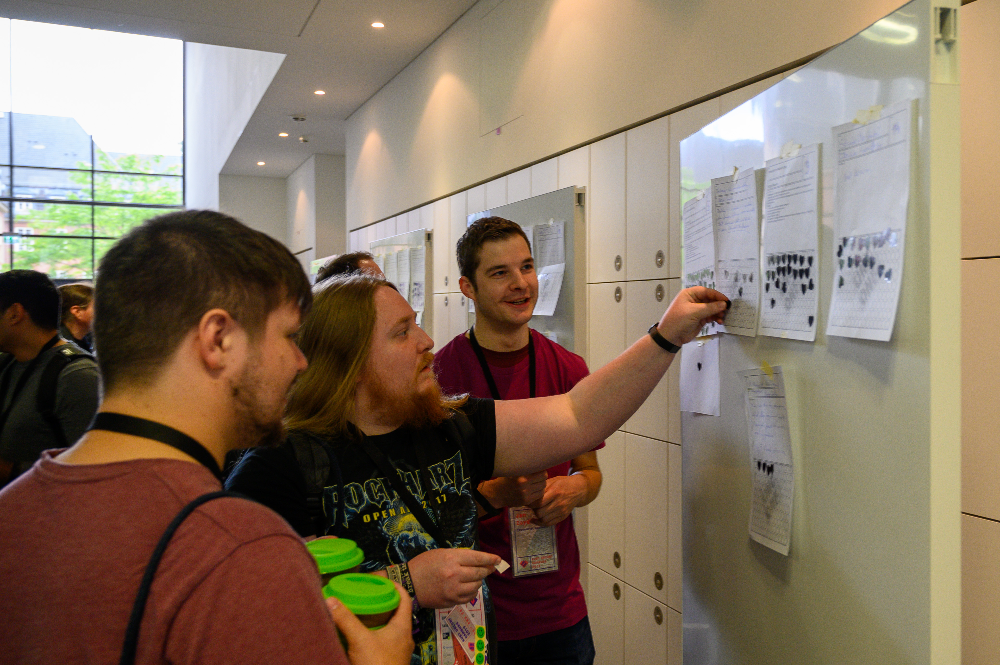
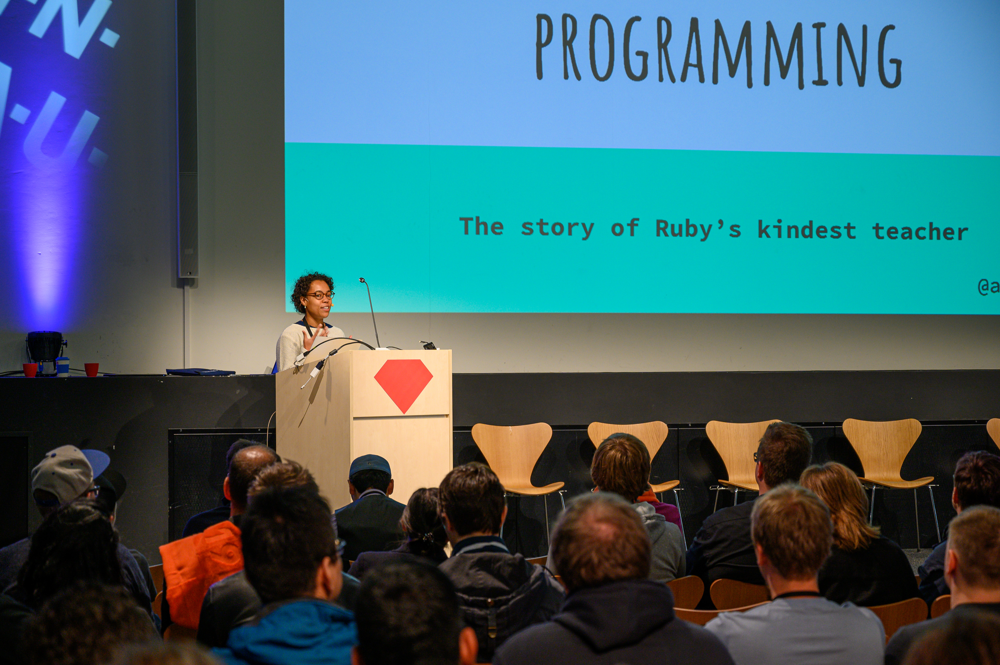
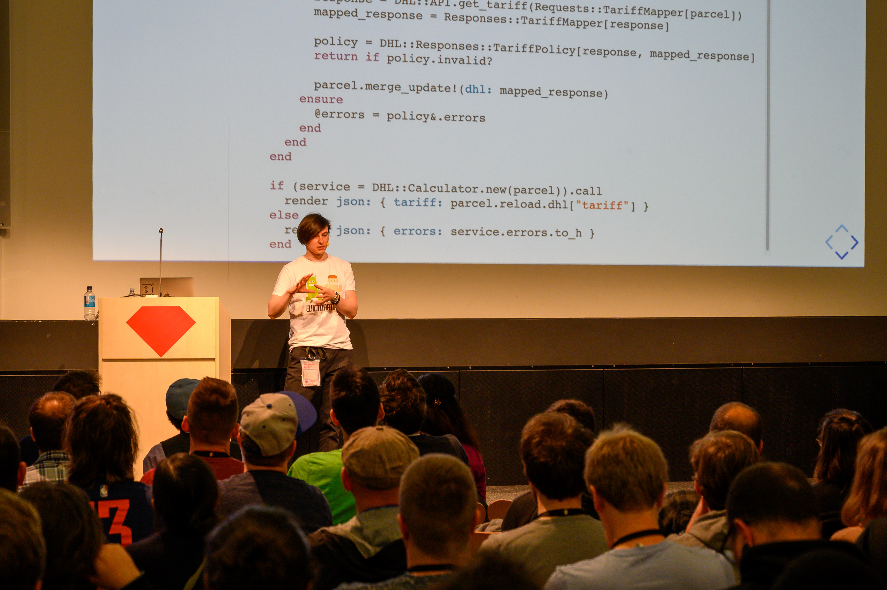
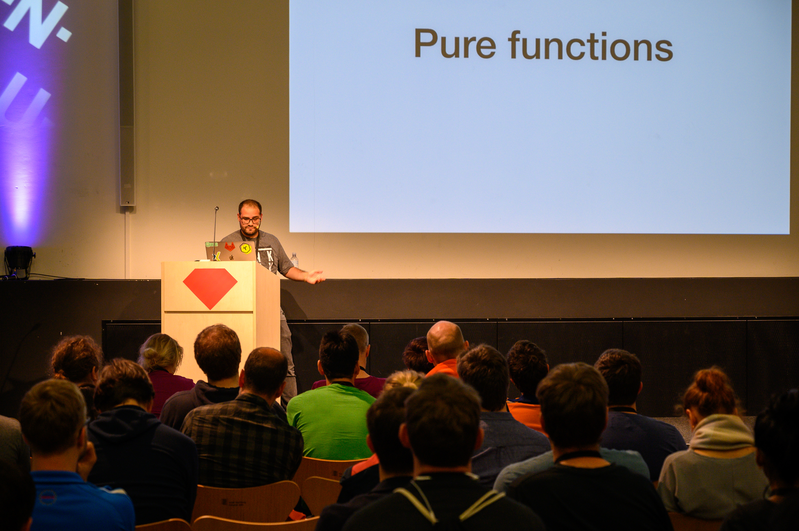

We introduced fishbowl discussions this year: an inclusive, dynamic format of audience discussion that lets everyone take the stage. The fishbowl on estimates was a hit: everyone had something to contribute ;)

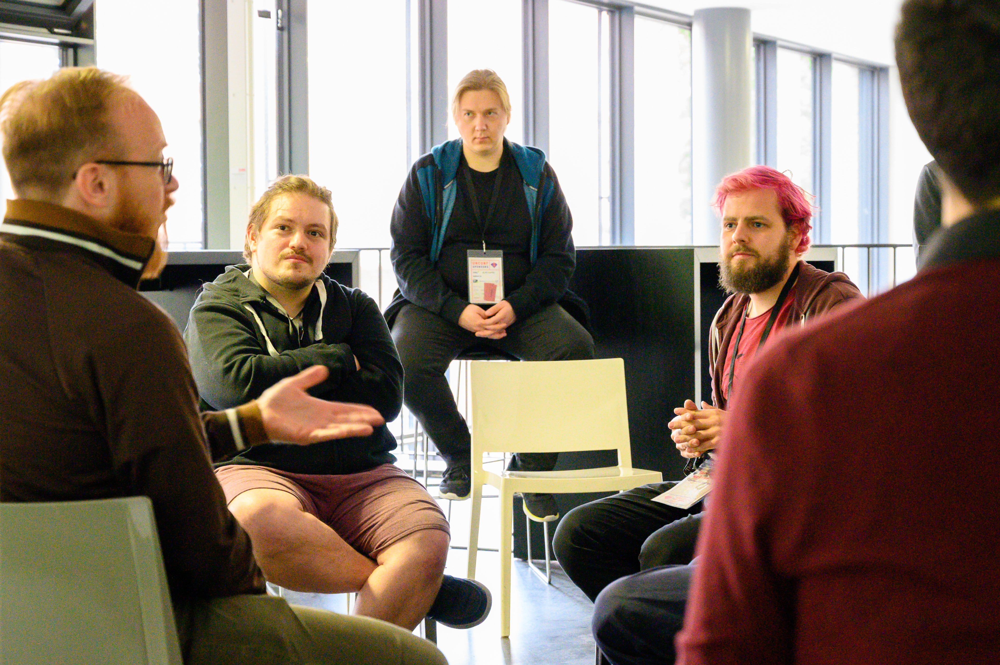

The party took us again to Reeperbahn, where we had a surprise guest: [Lia Sahin](https://www.instagram.com/lia_sahin/) beatboxed for us! We had a great time.
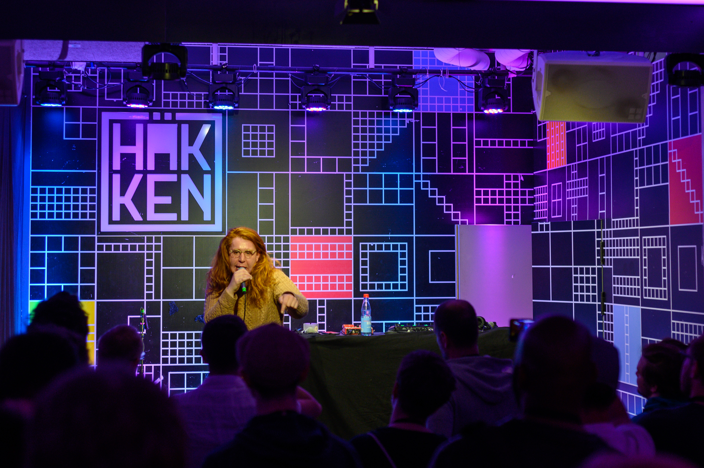
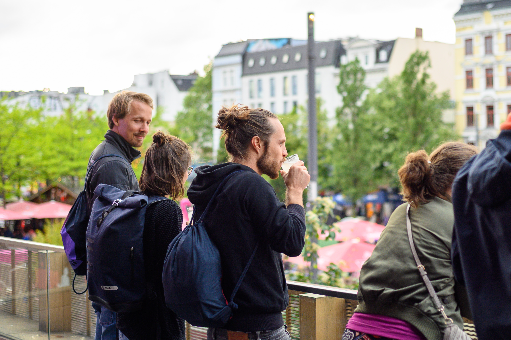
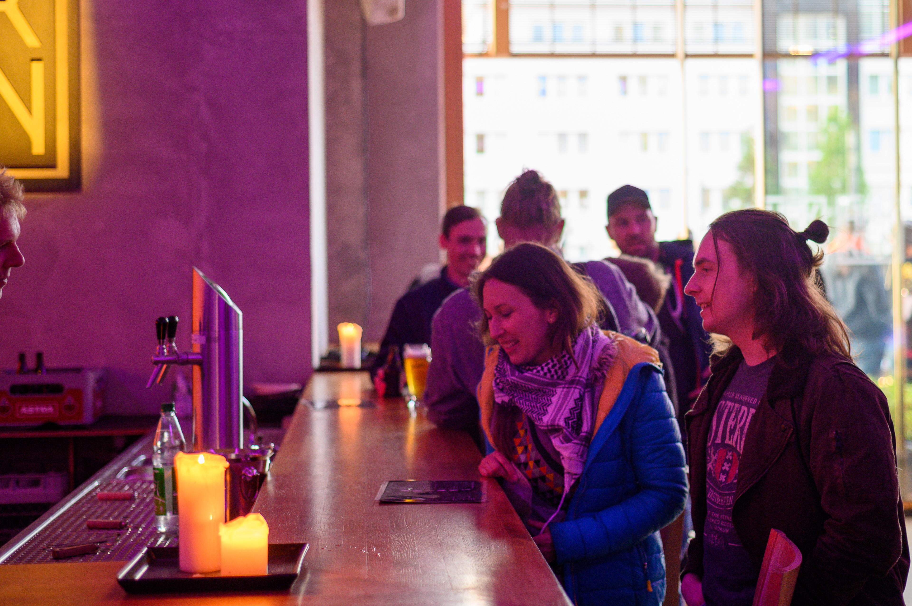

This year, we decided to take responsibility for our carbon footprint. We cooperated with [Plant-for-the-Planet](https://www.plant-for-the-planet.org/en/home) to calculate the carbon footprint generated by the visitors and venue, and created a carbon neutral event. [Start planting trees as well!](https://www.plant-for-the-planet.org/en/donation)

Thanks again to Amina, Torsten, Jonas, Sergey, Iulia, Matheus, Bente, Andreas, Stefan, Sven, Patrick, Ramon, Tina, Denys, Stefan, Daniel, David, Paul, Benjamin, Elizabeth, Mohammed, Yonatan, Marco who held talks and moderated discussions. This was your conference!

Make sure to follow us on [Twitter](https://twitter.com/RubyUnconfEU) and don't miss any announcements for next year.

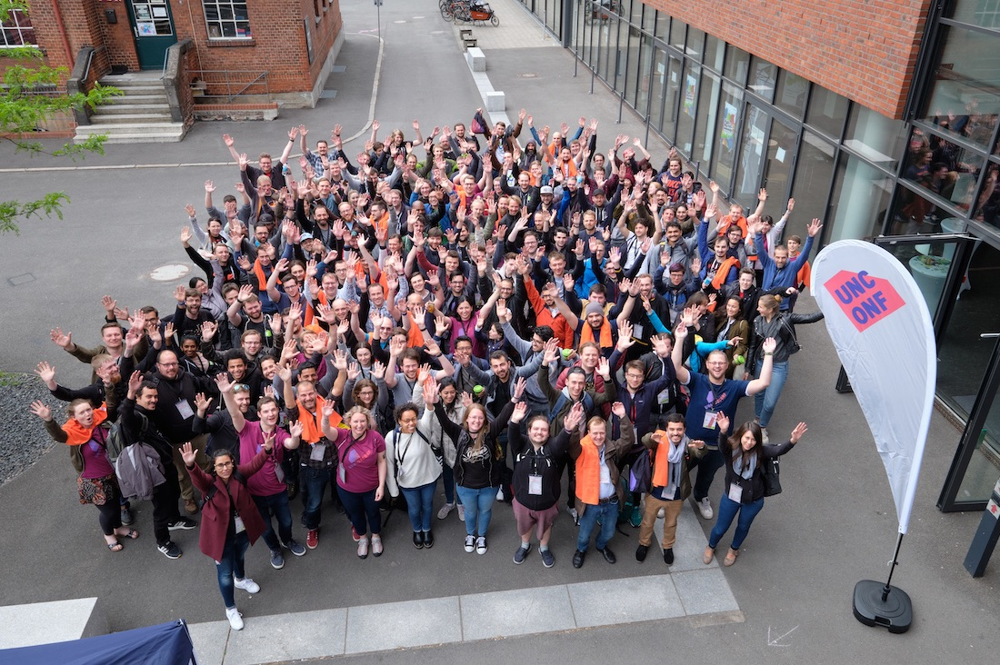