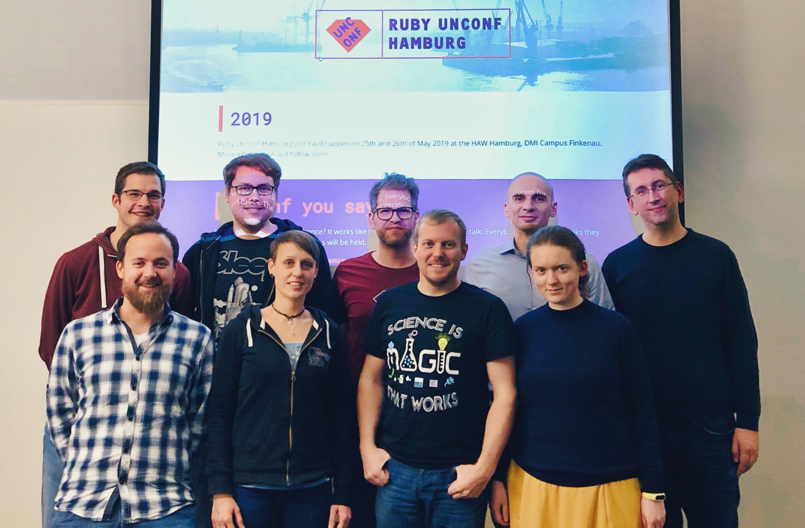

## 2019

Ruby Unconf Hamburg 2019 will happen on 25th and 26th of May 2019 at the HAW Hamburg, DMI Campus Finkenau.
More information will follow soon.

[Follow us on Twitter](https://twitter.com/RubyUnconfEU) to stay up to date.

## Tickets

### with all tickets you gain access to both conference days as well as free food, drinks and entry to the party.

  

    <a class="ticket" href="https://ti.to/ruby-unconf/2019">
      
regular

      

      
65,00€

    </a>

    <a class="ticket" href="https://ti.to/ruby-unconf/2019">
      
Combo ticket

      
RubyUnconf & JSUnconf

      
110,00€

    </a>

    <a class="ticket" href="https://ti.to/ruby-unconf/2019">
      
regular 

      
50% diversity support

      
97,50€

    </a>

    <a class="ticket" href="https://ti.to/ruby-unconf/2019">
      
regular

      
100% diversity support

      
130,00€

    </a>
  

Tickets are available via Tito: [https://ti.to/ruby-unconf/2019](https://ti.to/ruby-unconf/2019)

  

    
  

  
Gold Sponsors 

## Diversity

Our scholarship program is meant to make Ruby Unconf a better unconference. We want to make this community-focused event accessible to the wide range of people who are learning, work with, or are Ruby enthusiasts. We welcome applicants from underrepresented groups in tech to apply. This includes, but is not limited to: women-identifying persons, people of color, LGBTQIA people, people with physical and mental disabilities and people facing economic and/or political hardships. Scholarship recipients will receive a Ruby Unconf Hamburg 2019 ticket.

With the purchase of a diversity ticket you help us to make this happen.

The application form for diversity tickets will be available soon.

## Unconf you say?

What exactly is an Unconference? It works like this: Everybody can propose a talk. Everybody votes for the talks they want to see. The most voted talks will be held. You decide what will happen!

**Read more: <a href="https://gist.github.com/robertkowalski/8b21484c517c54d9b80aeba1d43864c9">What is an Unconference</a>**

## Venue

In 2019 we're hosted again by the <a href="https://www.haw-hamburg.de/english/about-us/faculties-departments/design-media-information.html">Hamburg University of Applied Sciences, Faculty of Design, Media and Information</a>.

  <iframe src="https://www.google.com/maps/embed?pb=!1m18!1m12!1m3!1d2369.3635298564614!2d10.031139751899804!3d53.56912837992829!2m3!1f0!2f0!3f0!3m2!1i1024!2i768!4f13.1!3m3!1m2!1s0x47b18ec9ad80408b%3A0x65298bd196908e49!2sHAW+Hamburg+-+Fakult%C3%A4t+DMI!5e0!3m2!1sde!2suk!4v1518718024833" style="border:0" allowfullscreen="" width="100%" height="400" frameborder="0"></iframe>

### Getting there

The easiest way to get there is by walking 500m from the U-Bahn (Underground) station "Mundsburg", which is about a 7 Minute ride away from the central station ("Hauptbahnhof").

It's probably not a good idea to try to go by car, as parking space is very limited and even on a saturday, we can't really recommend driving in Hamburgs inner city.

If you are arriving from Hamburg Airport, you should take the S-Bahn (Metro) to Barmbek and then the U-Bahn to Mundsburg.

### Surroundings

The Venue is right next to the Eilbekkanal, a channel that runs directly to the Alster lake ("Aussenalster") which is probably a 30 minute walk but especially worth it on a sunny spring day.

Next to the train station "Mundsburg" is one of Hamburgs largest shopping malls which includes a cinema (if you don't like partying on saturday night, for example) - Be warned though, all movies there are probably shown in german.

## Hamburg
Getting to Hamburg is easy - the Wikivoyage travel guide sums up everything you need to know about getting to and getting around Hamburg, finding a place to stay or even moving here: [Wikivoyage - Hamburg](https://en.wikivoyage.org/wiki/Hamburg)

If you are the first time in Hamburg we have some tipps for getting around here and what you should probably visit while being here. Having some days left before or after Ruby Unconf? [Hamburg is beautiful <3]({{site.baseurl}})

## 2018

The first Ruby Unconf Hamburg was a blast.

You can find the talks, pictures and everything else [here](/2018)

## Code Of Conduct

The heart of the Ruby Unconference is people. [This guideline](https://berlincodeofconduct.org/) is meant to support a happy, productive and safe event experience that can welcome new ideas and inspiration for all attendees. Regardless of gender, sexual orientation, age, ability, ethnicity, socioeconomic status, and religion (or lack thereof). We gain strength from diversity, and actively seek participation from those who enhance it.

Read the full [Berlin Code of Conduct here](https://berlincodeofconduct.org/).

## Contact

Please contact our team at <a href="mailto:info@rubyunconf.eu">info@rubyunconf.eu</a> if you have
any questions, remarks or ideas.

