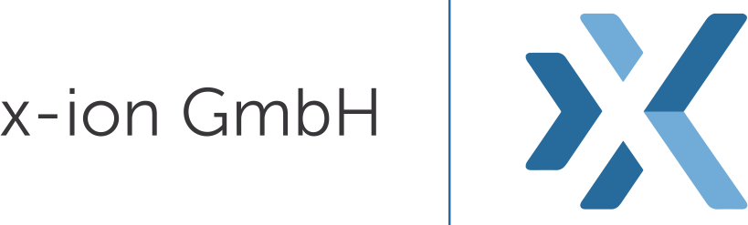
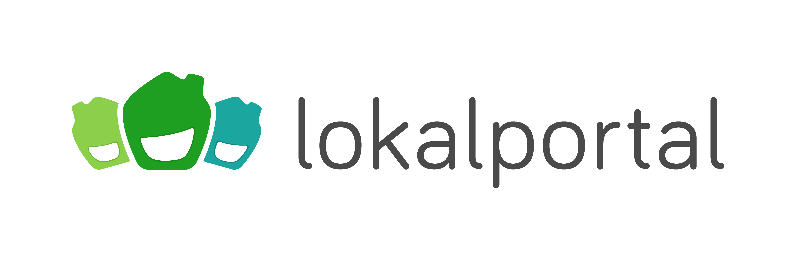
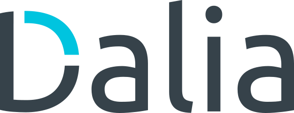

## Sponsors

Ruby Unconf Hamburg would not be possible without these great companies. We are very thankful for their support.
 
Be sure to pay them a visit!

Please <a href="mailto:sponsoring@rubyunconf.eu">contact us</a> about sponsoring. Or check out our <a href="https://drive.google.com/file/d/11QMNW0v7T9BrhfYtfJ7qm3It-MlTn1OT/view" target="_blank">sponsoring packages</a>. We are looking for sponsors!

## Gold Sponsors
  

    
     
    sum.cumo helps lottery and insurance companies prepare their business model for the digital age. Backed by years of industry experience and a service offering tailored to digitalisation, we are able to produce quick, simple and efficient solutions for our customers - from corporations to innovative start-ups. sum.cumo is not only a partner for modern technical solutions and marketing opportunities, but also helps establish a holistic, digital company philosophy that factors in new and existing potential in companies and the rapidly-changing market. Our Specialists in Strategy, Consulting, Communication and Technology at our offices in Zurich and Hamburg look forward to expanding on the success of their Customers and executing new, innovative projects, perhaps for your company as well. <a href="https://www.sumcumo.com/jobs" target="_blank">Be part of sum.cumo</a>!
  

  

    
     
    XING is the leading online business network in German-speaking countries. But XING is much more than just a brand – we’re also one of the largest and most active Ruby communities in Europe with over 400 software developers in Hamburg, Barcelona, Porto and Valencia. 
    We come from more than 50 different countries and embrace New Work on an international level by allowing you to do what you really, really want to do in our small, self-organised teams. This gives you the freedom to think and shape your actions based on what’s best for our challenges and those of our members. While we pursue our company’s current 20% annual growth rate, we also pioneer New Work by creating true impact for our members who are faced with the onset of digitalisation, major demographic change, and entirely new values on the labour market. Our challenge unites all of our brands: XING, XING E-Recruiting, XING Events, XING Marketing solutions, kununu, kununu engage, Prescreen, HalloFreelancer, and InterNations. 
    As you can see, we are no normal company and you can be part of it as we’re looking to hire more than 130 engineers in 2019. <a href="https://corporate.xing.com/en/career/" target="_blank">Join the challenge today</a>!
  

  

    
     
    talent.io is a completely free online platform for tech professionals to be visible to top tech companies when they are ready to find their next job. It is used by over 5000 tech companies across Europe as their platform to find and contact tech professionals to join their tech teams. 
    No need for a CV - simply import your LinkedIn profile, have a quick chat with your personal Talent Advocate to let them know what you are looking for and when you're ready, go live for a 4-week session on the platform while you are open to finding a new job. 
    On talent.io you state your desired work location, tech stack, salary expectation and desired new position upfront, so that you are contacted only with offers that are relevant to your prior experience, and where you want to go next. 
    There are no middle-men, receive offers from hiring companies directly and transparently.  
    If you're interested in being contacted directly by top tech companies for offers, find <a href="https://www.talent.io/?utm_source=event&utm_campaign=RubyUnConf&utm_content=talentioBlurb" target="_blank">talent.io</a> signup here!
  

## Silver Sponsors
  

    
     
    The "Wer liefert was" group helps small and medium-sized businesses in Europe to use digital channels for their sales and marketing activities. The company's offerings include the leading online B2B marketplace in the DACH region "Wer liefert was" (wlw) and the European platform EUROPAGES, as well as online marketing services that help companies to increase their reach on the Internet. 
    The "Wer liefert was" group employs more than 300 people at the offices in Hamburg and Paris. 
    <a href="https://www.wlw.de/en/firm/careers/jobs" target="_blank">Apply to one of our positions</a>.
  

  

    
     
    PhraseApp is a leading Translation Management System where localization teams come together to release translations faster and easier than ever before. PhraseApp provides a variety of features designed to improve translation quality and consistency, such as a Translation Memory, In-Context Editor or SmartSuggest. By providing various integration possibilities such as our API, Over the Air, and GitHub Sync, customers can easily integrate PhraseApp into their workflows. Founded in 2012, we have grown from a small start-up into a fast-paced team of 40 employees. With flat hierarchies, an agile spirit and big company goals, we always strive to improve our product. <a href="https://phraseapp.com/careers" target="_blank">We are hiring</a>!
  

  

    
     
    x-ion is the pioneer of tailor-made and legally compliant cloud infrastructure solutions! As a premium cloud provider, we are a reliable partner for businesses on their way into the cloud. 
    Since 2009 x-ion GmbH has been continuously growing. With our locations in Hamburg and Berlin we see ourselves as the provider for individual and high-quality cloud and infrastructure solutions. Together with our partners, we concentrate on the conception, development and operation of technologically challenging and customised solutions. 
    As a pioneer in the cloud business, the productive use and development of innovative technologies and frameworks is part of our identity - <a href="https://www.x-ion.de/karriere-x-ion/" target="_blank">we live cloud</a>!
  

## Party Sponsor
  

    TBA
  

## Coffee Sponsor
  

    
  

## Organization Sponsor
  

    
  

## Bronze Sponsors
  

    
  

  

    
  

  

    
  

  

    
  

  

    
  

  

      
  

## Community Sponsors
  

    
  

